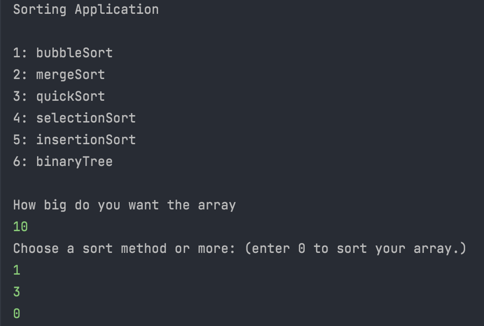
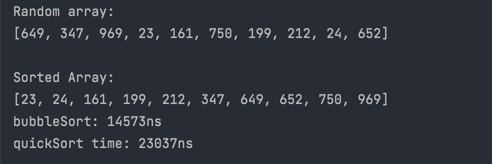

# __SpartaProject__: Sorting Application

### Introduction
Project work based on *__Java fundamentals__* during Sparta Global training.
Areas covered throughout the application:
* SOLID Principles:
* Model-View-Controller
* Recursion
* Interfaces
* OOP
* Design Patterns
  * Singleton
  * Factory Method

The application created is a sort manager at its most basic level. It allows the user to compare a variety of different sorting algorithms. (bubbleSort, mergeSort, quickSort etc.) 

The user is presented with sorting options, where they can select one or more to sort their array. The user is then prompted to select the size of the array where the application randomly generates the array. It then sorts the array and presents the user with both the original & sorted array, along with the sorting time in nanoseconds.

#### Runtime Example
*Included below shows a quick demonstration of how the application works.*
###### User Input

>The user is prompted to decide how big they would like their array to be. After entering the correct input, the application allows the user to choose from the given sorting methods displayed. (The user can choose more than one sorting method)

 

###### Array output 

> The application then sorts the randomly generated array with the user desired sorting algorithm. It displays both the original & sorted array. A sorting time is also displayed along with its respective algorithm used to sort the array.
